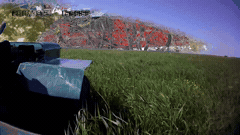
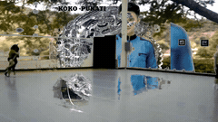
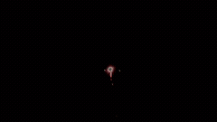
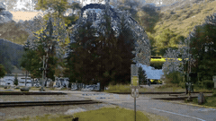

# collide-o-scope

a personal framework for generative video synthesis. takes scraped youtube footage, layers it, and applies color keying to create composite video art.

<p align="center">




</p>

the core technique: strip certain colors from video layers so you can see through to what's underneath. like chroma keying (green screen) but using colors that naturally occur in the footage — whites, blacks, dominant colors extracted via ML.

## how it works

1. scrape raw camera footage from youtube (low-view, DCIM-titled uploads)
2. randomly select and trim segments from the library
3. apply color keying to make parts of each layer transparent
4. stack layers on top of each other via ffmpeg overlay
5. mix audio from source videos with stereo panning
6. optionally post-process: grain, color grading, stabilization

## requirements

- python 3.10+
- ffmpeg + ffprobe (installed and on PATH)
- `pip install -r requirements.txt`

for ML background removal (optional):
```
pip install rembg onnxruntime
```

## structure

see [ARCHITECTURE.md](ARCHITECTURE.md) for the full breakdown. the short version:

```
scripts/     reusable tools (blend, audio, post, source, utils)
presets/     saved configurations organized by script type
projects/    individual bodies of work with their own inputs/outputs
library/     raw source material (video + audio)
tools/       standalone utilities
context/     reference material (original python scripts)
```

## quick start

```bash
# scan your video library and cache metadata
python scripts/source/scan-library.py

# run a blend with default settings
python scripts/blend/multi-layer.py

# run with a preset
python scripts/blend/multi-layer.py --preset kmeans-default

# batch render 10 videos
python tools/batch-render.py --count 10
```
